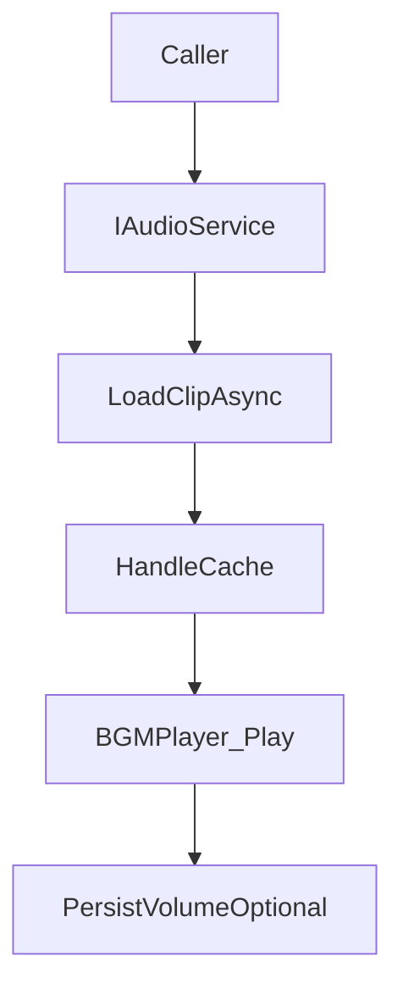

## Audio

`TFramework.Audio` は、BGM/SE の再生、AudioMixer連携、音量設定の永続化、AudioSourceの再利用を含むオーディオ基盤です。再生の入口を `IAudioService` に寄せ、ゲーム側が AudioSource や Addressables の扱いを直接抱えない形を目指します。

---

## 概要

- **責務**: BGM/SE制御、Mixer制御、音量永続化、クリップロードと解放
- **特徴**: SaveData（音量保存）と Resource/Addressables（クリップ取得）と連携しやすい構造

---

## 設計目標

- **運用性**: BGM/SEの差し替えやカテゴリ追加が容易
- **性能**: クリップのロード/キャッシュ、再生時の割り当て抑制
- **ユーザー設定**: 音量を永続化し、起動時に復元する

---

## 構成（抜粋）

- `Core/`
  - `AudioManager`: サービス実装（`IAudioService` / `IInitializable`）
  - `IAudioService`: サービス境界
  - `AudioModuleSettings`: 設定（Mixer、デフォルト音量等）
- `Components/`
  - `BGMPlayer`: BGM再生（フェードなど）
  - `SEPlayer`: SE再生
  - `AudioSourcePool`: AudioSourceの再利用
  - `AudioMixerController`: Mixer制御
- `Tests/`
  - Runtime/Scene の検証用テスト

---

## データ/処理フロー（BGM再生）

---

## APIの使い方（最小）

- **BGM**: `PlayBGMAsync(key)` / `StopBGM()` / `PauseBGM()` / `ResumeBGM()`
- **SE**: `PlaySE(key)` / `PlaySE3D(key, pos)`
- **注意**: クリップキーの命名とAddressables側の運用ルールを決めると、運用負債が大きく減る

---

## Settings

- `AudioModuleSettings` は `Resources` 配下の設定アセットとして運用します。
- Settingsの作成/移動は `TFramework/Settings/Modules`（Settings Window）から行います。

---

## 未実装 / 今後

- `ROADMAP.md` の **フェーズ3** を参照
- 音量カテゴリの拡張、Duckingの運用ガイド、クリップ管理の診断（ロード数/メモリ）

