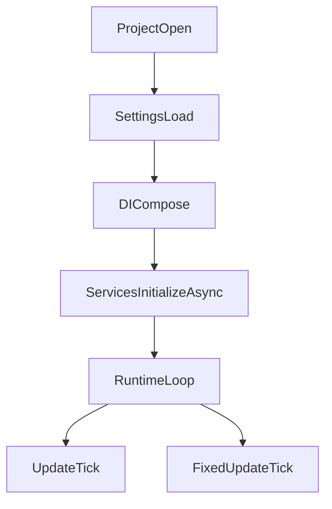

## Core

`TFramework.Core` は、各モジュールが依存する「共通の契約」と「起動・更新の足回り」を提供します。Unityプロジェクトで発生しやすい初期化順序の崩壊や参照の増殖を抑え、モジュール追加時にも破綻しにくい構成を目指しています。

---

## 概要

- **責務**: フレームワークの基盤（サービス境界、初期化、更新ループ、共通拡張）
- **前提**: 実装は DI（VContainer）上で組み立て、利用側はインターフェース中心で依存する

---

## 設計目標

- **初期化順序の明確化**: 「いつ使ってよいか」を曖昧にしない
- **依存の向きの統制**: モジュールは `Core` の契約に依存し、相互参照は避ける
- **Unity依存の局所化**: 可能な部分はPure C#としてテストしやすくする

---

## 構成（抜粋）

- `Bootstrap/`
  - `TFrameworkBootstrap`: フレームワーク起動のエントリポイント
  - `TFrameworkSettings`: 設定の集約（Settingsアセット）
- `Interfaces/`
  - `IService`: サービス境界
  - `IInitializable`: 非同期初期化の契約
  - `ITickable`: 更新契約
- `Extensions/`
  - `UniTaskExtensions`, `R3Extensions`: 非同期/リアクティブの利用補助
- `Editor/`（運用支援）
  - `TFrameworkModuleSettingsWindow`: Settingsアセット運用のためのEditorWindow
  - `ModuleSettingsCatalog`: モジュールSettingsのカタログ
  - `SettingsAssetUtility`: Settingsアセット検出/作成/移動/複製のユーティリティ

---

## 処理フロー（起動〜利用）

---

## 使い方（最小）

- **利用側の基本**: 直接 `new` せず、DI登録された `IService` / `IInitializable` を参照する
- **初期化が必要なサービス**: `IInitializable` を実装し、起動時に `InitializeAsync` が呼ばれる設計を前提にする

---

## Settings（運用）

Settingsは `Resources` 配下の ScriptableObject を前提にしています。EditorWindowから以下を行います。

- **Install**: Settingsが無い場合に作成
- **Move / Duplicate**: `Resources` 外にある場合の移動/複製

---

## 未実装 / 今後

- `ROADMAP.md` の **フェーズ1**（Core/Resource/Pool/Debug）を参照
- Bootstrappingの一本化と、失敗時のフォールバック戦略の整備

