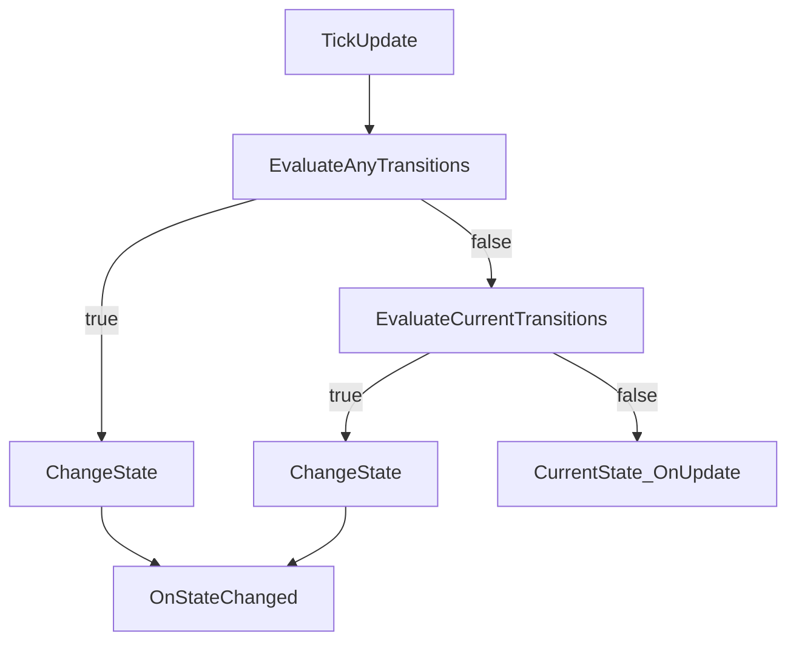

## FSM

`TFramework.FSM` は、ゲーム進行やサブシステムの状態管理に使える最小構成の有限ステートマシン（FSM）です。状態・遷移・任意状態からの遷移（AnyTransition）を持ち、状態変更イベントをObservableとして外へ公開します。

---

## 概要

- **責務**: 状態（State）の管理、遷移（Transition）の評価、状態変更通知
- **用途**: ゲームフロー、UI状態、AI状態、チュートリアル進行など

---

## 設計目標

- **小さく始める**: 最小機能で導入し、必要になったタイミングで拡張する
- **状態を自己完結**: `OnEnter/OnExit/OnUpdate` に責務を閉じ、呼び出し側の分岐を減らす
- **観測可能性**: 状態変更をストリームとして扱い、ログ/デバッグに繋げる

---

## 構成（抜粋）

- `Core/`
  - `StateMachine<TOwner>`: ステート管理
  - `IState<TOwner>`: 状態契約
  - `StateBase<TOwner>`: 状態基底（StateMachine参照を保持可能）
- `Transition/`
  - `StateTransition`: 遷移（遷移先Type + 条件）
  - `ITransitionCondition`: 条件の抽象（必要に応じて拡張）
- `Tests/`
  - Runtime テスト（状態遷移、AnyTransition 等）

---

## データ/処理フロー（Updateで遷移評価）

---

## APIの使い方（最小）

- **状態追加**: `AddState<TState>()` または `AddState(stateInstance)`
- **遷移追加**: `AddTransition<TFrom,TTo>(condition)` / `AddTransitionFromAny<TTo>(condition)`
- **遷移**: `ChangeState<TState>()`
- **更新**: `Update()` / `FixedUpdate()` を呼び出し側のループから呼ぶ設計を想定

---

## 未実装 / 今後

- `ROADMAP.md` の **フェーズ4**（FSM/SDK）を参照
- デバッグ可視化（現在状態、遷移履歴）と運用ガイドの整備

