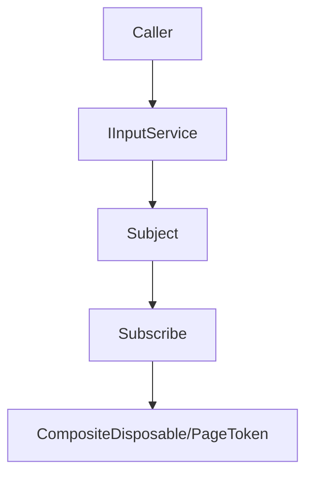

## Input

`TFramework.Input` は、Unity Input System をラップした抽象化レイヤーです。入力イベントを `Observable<InputEvent>` として公開することで、利用側が具体的な入力デバイスや生のアクションに直接依存しない、疎結合な構成を提供します。

---

## 概要

- **主な責務**: 入力イベントの購読、有効化/無効化の制御、入力ロック管理
- **特徴**: R3 によるリアクティブなイベント発行、CompositeDisposable を用いた購読ライフサイクル管理

---

## 設計目標

- **抽象化**: 生の `InputAction` をカプセル化し、デバイス非依存なコードを記述しやすくする
- **購読管理**: 購読ルールの統一により、メモリリークや重複購読を防止する
- **柔軟性**: 入力デバイスの差し替えやアクション定義（バインド）の変更に強い構成

---

## 構成（抜粋）

- `Core/`
  - `IInputService`: 入力モジュールの統合インターフェース
  - `InputEvent`: 入力データを保持する構造体
  - `GameInputAction`: アクションの識別子（Move, Jump, Interact 等）
  - `InputPhase`: アクションのフェーズ（Started, Performed, Canceled）
- `Services/`
  - `UnityInputService`: Unity Input System を用いた実実装
- `Settings/`
  - `InputModuleSettings`: モジュールの初期設定（ScriptableObject）

---

## データ/処理フロー



---

## 使い方

### 1. サービスの注入
VContainer を通じて `IInputService` を取得します。

```csharp
[Inject]
private IInputService _inputService;
```

### 2. ボタン入力の購読
ジャンプや攻撃などの単発入力は、`Phase` が `Performed` のタイミングをフィルタリングして購読します。

```csharp
_inputService.OnInputEvent
    .Where(e => e.Action == GameInputAction.Jump && e.Phase == InputPhase.Performed)
    .Subscribe(_ => Jump())
    .AddTo(this);
```

### 3. 値（Vector2）の取得
移動や視点操作などの `Value` を持つアクションは、イベントから値を抽出して利用します。

```csharp
_inputService.OnInputEvent
    .Where(e => e.Action == GameInputAction.Move)
    .Subscribe(e => 
    {
        // Vector2 値の取得
        Vector2 moveDir = e.Value;
        _player.Move(moveDir);
    })
    .AddTo(this);
```

### 4. アクションフェーズの制御
「ボタンを押し始めた」「離した」などのタイミングを個別に扱いたい場合は、`InputPhase` を利用します。

```csharp
_inputService.OnInputEvent
    .Where(e => e.Action == GameInputAction.Hold)
    .Subscribe(e => 
    {
        switch (e.Phase)
        {
            case InputPhase.Started:   /* 溜め開始 */ break;
            case InputPhase.Performed: /* 最大まで溜まった */ break;
            case InputPhase.Canceled:  /* 中断/終了 */ break;
        }
    })
    .AddTo(this);
```

### 5. 入力のロック
カットシーンやダイアログ表示中など、一時的にプレイヤーの入力を無効化したい場合に利用します。

```csharp
// 入力をロックし、解除用のハンドルを受け取る
IDisposable lockHandle = _inputService.LockInput();

// 解除（演出終了時など）
lockHandle.Dispose();
```

---

## Settings

`InputModuleSettings` は `Resources` 配下の設定アセットとして管理されます。
以下の設定ができます。

- **Enable On Start**: 起動時に自動で入力を有効化するか
- **Lock On Player Incapacitated**: プレイヤーのステータス異常時等に自動ロックするか（将来拡張用）

アセットの作成・移動は **Settings Window**（`TFramework/Settings/Modules`）から行えます。

---

## 今後の対応予定

- マルチタッチやジェスチャー等への対応
- ジャイロ等の各種センサーデバイスへの対応
- 入力マッピングの動的変更機能（Rebindingサポート）
- スクリプタブルなバインド定義の可変設定化
- 異なるプラットフォーム間の入力マッピングの自動切り替え