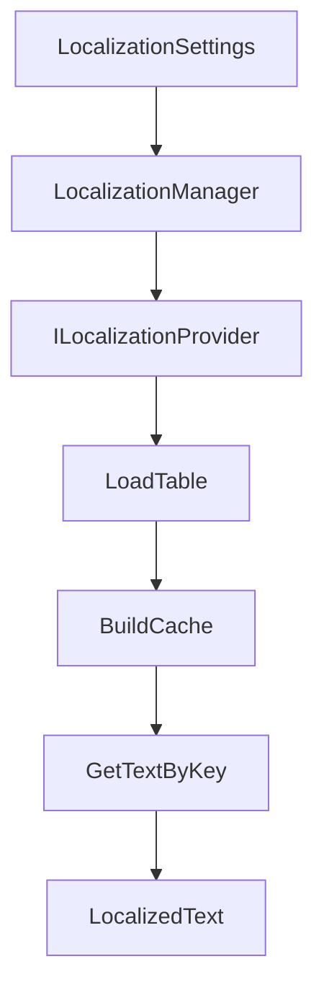

## Localization

`TFramework.Localization` は、ゲーム内テキストを言語ごとに切り替えるための基盤です。テーブル（CSV等）を取り込み、キーから文字列を引ける形に統一し、言語変更時の更新通知を扱えるようにします。

---

## 概要

- **責務**: 言語設定、ローカライズテーブルのロード、文字列取得、言語切替通知
- **想定**: 最小構成は CSV をベースにし、必要に応じて JSON 等へ拡張

---

## 設計目標

- **運用の単純化**: 文字列追加をテーブル中心に寄せる（コード変更を最小化）
- **キャッシュ**: 参照頻度の高いキー取得を軽くする
- **切替の一貫性**: 言語切替の通知を明確化し、UI更新漏れを減らす

---

## 構成（抜粋）

- `Core/`
  - `LocalizationManager`: サービス実装（ロード/検索/通知）
  - `LocalizationSettings`: 設定（対応言語、テーブル参照など）
- `Interfaces/`
  - `ILocalizationService`: サービス境界
- `Provider/`
  - `ILocalizationProvider`: ロード実装の差し替え点
  - `CsvLocalizationProvider`: CSV読み込み実装
- `Data/`
  - `LanguageCode`: 言語コード
  - `LocalizationTable`: テーブル表現
- `Components/`
  - `LocalizedText`: UIへ反映するためのコンポーネント

---

## データ/処理フロー（テーブルロード〜表示反映）

---

## APIの使い方（最小）

- **キー参照**: 文字列はキー経由で取得する（言語依存の文字列をコードへ直書きしない）
- **言語切替**: 切替イベントを購読し、UIを再描画する（`LocalizedText` で吸収する設計を想定）

---

## Settings

- `LocalizationSettings` は `Resources` 配下の設定アセットとして運用します。
- Settingsの作成/移動は `TFramework/Settings/Modules`（Settings Window）から行います。

---

## 未実装 / 今後

- `ROADMAP.md` の **フェーズ2** を参照
- Provider拡張（JSON等）と、テーブル検証の強化（CI向け）

