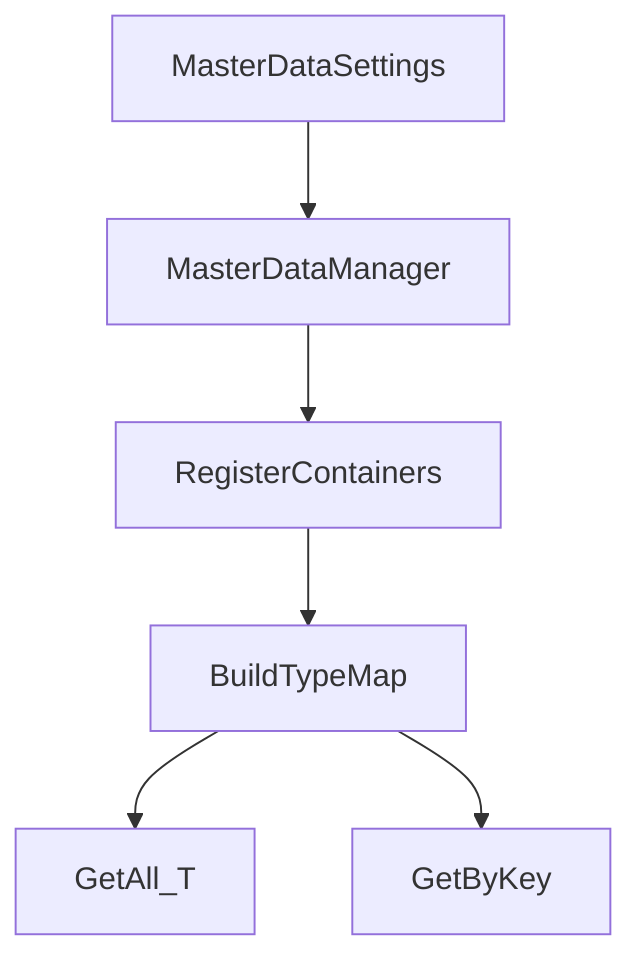

## MasterData

`TFramework.MasterData` は、ゲームのマスターデータ（キャラクター、アイテム、クエスト等）を「型安全に参照できる形」で運用するためのモジュールです。Unityでは ScriptableObject をコンテナとして扱い、読み込み・キャッシュ・検索をサービスとして統一します。

---

## 概要

- **責務**: マスターデータのロード、コンテナ登録、全件取得、キー検索
- **前提**: データはコンテナ（ScriptableObject）にまとまり、サービスは `IMasterDataService` で提供する

---

## 設計目標

- **型安全**: 「文字列キーで何でも取る」設計を避け、データ型で境界を作る
- **運用性**: 追加・更新の頻度が高いデータをコード変更最小で扱えるようにする
- **拡張性**: コンテナ形式（生成コード等）に合わせて最適化できる余地を残す

---

## 構成（抜粋）

- `Core/`
  - `MasterDataManager`: サービス実装（`IMasterDataService` / `IInitializable`）
  - `IMasterDataService`: 取得API（`GetAll<T>()`, `Get<T,TKey>(key)`）
  - `IMasterDataObject`: データ共通契約
  - `IMasterDataObject<TKey>`: メインキーの契約（`GetKey()`）
  - `MasterDataSettings`: 自動ロードやコンテナ一覧の設定
- `Editor/`
  - `CodeGenerator`, `MasterDataImporterWindow`, `MasterDataViewerWindow` など運用支援

---

## データ/処理フロー（登録〜取得）

---

## APIの使い方（最小）

- **全件取得**: `GetAll<T>()` で `IReadOnlyList<T>` を得る
- **キー取得**: `Get<T,TKey>(key)` で1件取得する
- **注意**: 現状の `Get` は線形探索が基本なので、必要に応じてコンテナ側で最適化（辞書化等）する設計を想定

---

## Settings

- `MasterDataSettings` は `Resources` 配下の設定アセットとして運用します。
- Settingsの作成/移動は `TFramework/Settings/Modules`（Settings Window）から行います。

---

## 未実装 / 今後

- `ROADMAP.md` の **フェーズ3**（MasterData/SaveData/Audio/Network）を参照
- コンテナの最適化（キー辞書化、差分更新、バージョン管理）と CI向け検証

