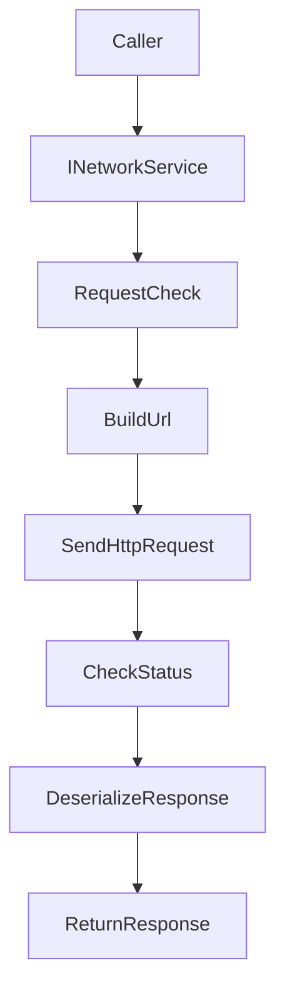

## Network

`TFramework.Network` は、HTTP通信・シリアライズ・APIリクエスト送信を統一するモジュールです。呼び出し側は「API（型）」と「Request」を渡すだけに寄せ、URL組み立て、送信、失敗時の例外表現、レスポンスのデシリアライズを共通化します。

---

## 概要

- **責務**: HTTPクライアント抽象、シリアライズ抽象、API送信、エラー表現、設定（BaseUrl等）
- **前提**: DIにより `IHttpClient` / `INetworkSerializer` / `NetworkSettings` を注入する

---

## 設計目標

- **統一された失敗表現**: HTTP失敗・検証失敗・デシリアライズ失敗を `NetworkException` に寄せる
- **拡張性**: 認証ヘッダ付与やリトライ等を後から挿入しやすい構造
- **生成コード連携**: Generated API を「薄いラッパ」として接続できるようにする

---

## 構成（抜粋）

- `Core/`
  - `NetworkManager`: サービス実装（`INetworkService` / `IInitializable`）
  - `INetworkService`: API送信の境界
  - `ApiBase`, `RequestBase`, `ResponseBase`: API/Request/Response の共通基底
  - `NetworkSettings`: BaseUrl等の設定
- `HTTP/`
  - `IHttpClient`, `UnityHttpClient`
  - `HttpRequest`, `HttpResponse`, `ApiType`
- `Serialization/`
  - `INetworkSerializer`, `JsonNetworkSerializer`
- `Error/`
  - `NetworkException`
- `Generated/`（存在する場合）
  - 生成されたAPI/モデル
- `Editor/`
  - `NetworkApiCodeGenerator`, `NetworkEnvironmentSwitcher` など運用支援
- `Tests/`
  - Runtime テスト

---

## データ/処理フロー（SendAsync）

---

## APIの使い方（最小）

- **送信**: `SendAsync(api, request, ct)`
- **リクエスト検証**: `RequestBase.Check()` が通らない場合は送信しない
- **拡張ポイント**: 将来的に AuthInterceptor 等を挟み、ヘッダ付与・署名・再試行を統一する想定

---

## Settings

- `NetworkSettings` は `Resources` 配下の設定アセットとして運用します。
- Settingsの作成/移動は `TFramework/Settings/Modules`（Settings Window）から行います。

---

## 未実装 / 今後

- `ROADMAP.md` の **フェーズ3** を参照
- 認証・再試行・レート制御・ログ相関IDなどの横断機能を追加しやすい形へ整理

