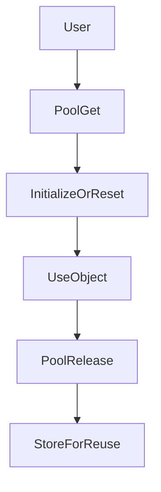

## Pool

`TFramework.Pool` は、頻繁に生成・破棄されるオブジェクト（C#オブジェクト / Unityオブジェクト）を再利用し、GC負荷やInstantiateコストを抑えるための共通プール基盤です。用途に応じて「汎用プール」と「GameObject向けプール」を使い分けられる構成を想定しています。

---

## 概要

- **責務**: オブジェクトの再利用（取得/返却）、プールのライフサイクル管理
- **対象**: Generic（List/Dictionary/StringBuilder 等）と Unity GameObject

---

## 設計目標

- **割り当て削減**: フレーム単位での小さな割り当てを抑える
- **再利用の一貫性**: 取得/返却のルールを共通化する
- **デバッグ可能性**: 上限/ヒット率/リークを追える形にする（今後の深化）

---

## 構成（抜粋）

- `Core/`
  - `PoolManager`: プールの集約管理
  - `GameObjectPool`: GameObject向けのプール
- `Interfaces/`
  - `IPoolManager`: 管理の境界
  - `IPoolable`: 再利用時の初期化契約
- `Generic/`
  - `ObjectPool`, `ListPool`, `DictionaryPool`, `StringBuilderPool`: 汎用プール

---

## 処理フロー（取得と返却）

---

## 使い方（最小）

- **短命オブジェクト**: `Generic/*Pool` を利用し、利用後すぐ返却する
- **Unityオブジェクト**: 生成コストの高いPrefabは `GameObjectPool` で再利用する

---

## 未実装 / 今後

- `ROADMAP.md` の **フェーズ1** を参照
- 計測（最大数、ヒット率、スパイク時の挙動）とチューニング導線

