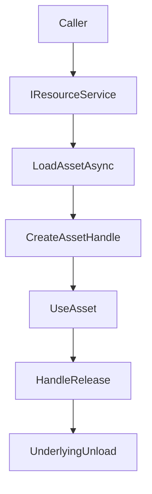

## Resource

`TFramework.Resource` は、アセット取得の差異（Addressables / Resources など）を吸収し、ロード・保持・解放の規律をモジュール側に押し付けないための層です。最終的には「ハンドルを中心にしたライフサイクル管理」を標準化し、メモリと参照の事故を減らすことを狙います。

---

## 概要

- **責務**: アセットのロード/参照管理/解放を統一APIで提供
- **想定**: Addressables を中心に、実装差し替えが可能

---

## 設計目標

- **参照の見える化**: 何が保持されているかを追跡可能にする
- **解放の規律**: 「いつ解放するか」をコード上の責務として表現する
- **呼び出し側の単純化**: 呼び出し側は `IResourceService` を通して取得する

---

## 構成（抜粋）

- `Interfaces/`
  - `IResourceService`: リソース取得のサービス境界
  - `IAssetHandle`: ハンドルの契約（保持/解放の単位）
- `Services/`
  - `AddressableResourceService`: Addressables 実装
- `Handle/`
  - `AssetHandle`: 単体ハンドル
  - `AssetHandleGroup`: 複数ハンドルのグルーピング

---

## データ/処理フロー（ロードと解放）

---

## 使い方（最小）

- **原則**: アセットは「取得したら持ち方を決める（短命/長命）」をセットで考える
- **推奨**: ハンドルを `AssetHandleGroup` で束ね、画面/シーン単位で一括解放できる設計に寄せる

---

## Settings

Resource モジュール自体の設定がある場合は、`Resources` 配下のSettingsとして管理します（作成/移動は Settings Window 経由）。

---

## 未実装 / 今後

- `ROADMAP.md` の **フェーズ1** を参照
- ハンドル管理の規約化（誰が所有し、いつ解放するか）
- 計測（ロード時間/キャッシュヒット/メモリ）と診断の整備

