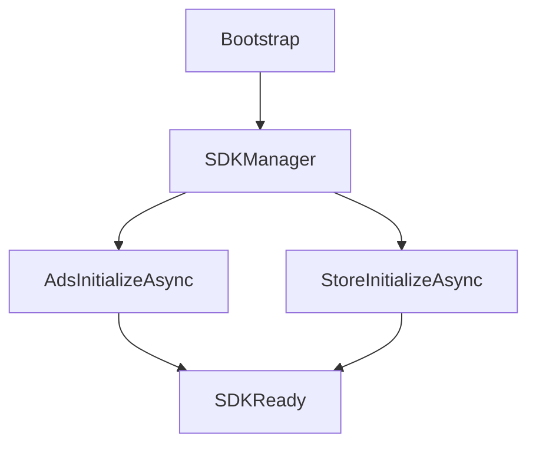

## SDK

`TFramework.SDK` は、広告（Ads）/分析（Analytics）/ストア（Store）といった外部SDKを、ゲームコードから切り離すための抽象レイヤです。ゲーム側はインターフェースへ依存し、実装（Provider）はDIで差し替える方針を前提にしています。

現状は「差し替え可能な入口」として、Adsに Editor 検証用の `DummyAdsProvider` を同梱しています。

---

## 概要

- **責務**: SDKサービスのインターフェース定義、サービス集約（SDKManager）、ダミー実装
- **狙い**: SDK変更（AdMob→別SDK等）時の影響範囲を最小化する

---

## 設計目標

- **依存の向きの統制**: ゲームコードは `IAdsService` 等に依存し、具体SDKへ直接依存しない
- **初期化の統一**: `InitializeAsync(ct)` を共通化し、起動順を揃える
- **テスト容易性**: Dummy/Mock を差し替えて挙動を検証できる

---

## 構成（抜粋）

- `Core/`
  - `SDKManager`: Ads/Analytics/Store を集約するエントリ
- `Ads/`
  - `IAdsService`: 広告サービス契約
  - `DummyAdsProvider`: Editor向けのダミー実装
- `Analytics/`
  - `IAnalyticsService`: 分析サービス契約
- `Store/`
  - `IStoreService`: ストア（課金）サービス契約
- `Tests/`
  - Runtime テスト（SDKManager + DummyAdsProvider）

---

## データ/処理フロー（初期化）

---

## APIの使い方（最小）

- **初期化**: `SDKManager.InitializeAsync(ct)`（内部で Ads/Store の初期化を実行）
- **利用**: `SDKManager.Instance.Ads` のように集約点からアクセス（またはDIで直接注入）
- **Provider差し替え**: 実運用では各SDKに対応した Provider を実装し、DIで差し替える想定

---

## 未実装 / 今後

- `ROADMAP.md` の **フェーズ4** を参照
- Provider実装例（Unity Ads / Firebase 等）の追加と、失敗時設計（フォールバック/復帰）の整理

