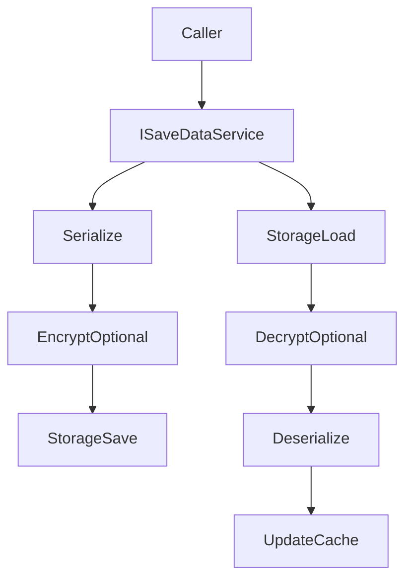

## SaveData

`TFramework.SaveData` は、プレイヤーデータの保存/読み込みを統一するモジュールです。保存先（File / PlayerPrefs）や暗号化（AES / None）を設定で切り替えられる構成にし、ゲーム側は `ISaveDataService` のAPIだけを使う形を目指します。

---

## 概要

- **責務**: 保存/読み込み、スロット管理、キャッシュ、暗号化、シリアライズ
- **設計**: `IStorageProvider` / `IEncryptionProvider` / `ISaveDataSerializer` を分離し、要件変更に対応しやすくする

---

## 設計目標

- **境界の明確化**: ストレージ・暗号化・シリアライズを差し替え可能にする
- **安全性**: 破損/欠損時の復旧戦略を入れられる余地を残す
- **運用性**: スロットやキーの増加に耐える（命名規約、移行が可能）

---

## 構成（抜粋）

- `Core/`
  - `SaveDataManager`: サービス実装（`ISaveDataService` / `IInitializable`）
  - `SaveDataSettings`: 保存設定（保存先、暗号化種別、鍵など）
  - `IStorageProvider`: 保存先の境界
  - `IEncryptionProvider`: 暗号化の境界
  - `ISaveDataSerializer`: シリアライズの境界
- `Provider/`
  - `FileStorageProvider`, `PlayerPrefsStorageProvider`
  - `AESEncryptionProvider`
  - `JsonSaveDataSerializer`
- `Editor/`
  - `SaveDataEditorWindow`: 運用支援
- `Tests/`
  - Provider/Serializer/Encryption のテスト

---

## データ/処理フロー（Save/Load）

---

## APIの使い方（最小）

- **保存**: `SaveAsync(key, data)`（内部で Serialize → Encrypt → Save）
- **読み込み**: `LoadAsync(key, default)`（内部で Load → Decrypt → Deserialize）
- **スロット**: `SetSlot(slot)` でスロット切替（切替時にキャッシュクリア）

---

## Settings

- `SaveDataSettings` は `Resources` 配下の設定アセットとして運用します。
- Settingsの作成/移動は `TFramework/Settings/Modules`（Settings Window）から行います。

---

## 未実装 / 今後

- `ROADMAP.md` の **フェーズ3** を参照
- 破損復旧（バックアップ/バージョニング）と、Provider差し替えのガイド整備

