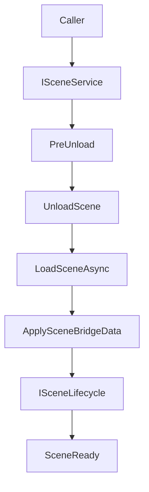

## Scene

`TFramework.Scene` は、シーンのロード/アンロード、遷移、シーン固有のライフサイクルを統一するためのモジュールです。画面遷移（UI）とは別に、シーン遷移に伴う「待機」「演出」「データ受け渡し」を整理し、運用で破綻しやすい初期化順の問題を抑えることを目的にしています。

---

## 概要

- **責務**: シーン遷移の統合、ライフサイクル、ブリッジデータ（受け渡し）
- **想定**: フェード等の遷移演出、Addressables連携は段階的に拡張

---

## 設計目標

- **遷移の規約化**: どの画面/状態からでも同じ手順で遷移できるようにする
- **非同期の標準化**: ロード待機を `UniTask` で扱い、キャンセル可能にする
- **データ受け渡し**: 受け渡しデータを `ISceneBridgeData` で明示する

---

## 構成（抜粋）

- `Core/`
  - `SceneManager`: シーンサービスの実装
  - `ISceneService`: サービス境界
  - `ISceneBridgeData`: シーン間データ受け渡しの契約
- `Lifecycle/`
  - `ISceneLifecycle`: ライフサイクル契約
  - `SceneControllerBase`: シーン側の制御基底
- `Settings/`
  - `SceneSettings`: 設定

---

## データ/処理フロー（シーン遷移）

---

## APIの使い方（最小）

- **遷移要求**: `ISceneService` に遷移を依頼し、呼び出し側はロード待機の詳細を抱えない
- **ブリッジデータ**: シーン間の引き継ぎは `ISceneBridgeData` で表現し、参照の直結を避ける

---

## Settings

- `SceneSettings` は `Resources` 配下の設定アセットとして運用します。
- Settingsの作成/移動は `TFramework/Settings/Modules`（Settings Window）から行います。

---

## 未実装 / 今後

- `ROADMAP.md` の **フェーズ2** を参照
- フェード/演出、Addressables連携、遷移の診断ログの整備

