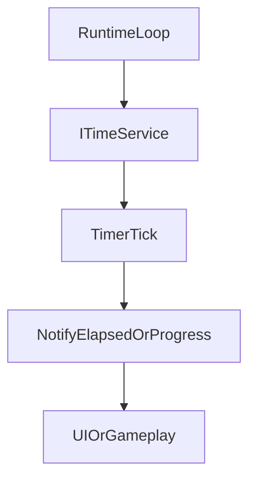

## Time

`TFramework.Time` は、タイマー・ストップウォッチ・カウントダウンといった「時間を扱う処理」をサービスとしてまとめるモジュールです。ゲーム進行（演出、クールタイム、UI表示など）に時間が絡む処理を散らさず、テストしやすい形へ寄せることを狙います。

---

## 概要

- **責務**: 時間サービス、タイマー実装、時間スケール適用の基盤
- **対象**: カウントダウン、ストップウォッチ、待機補助（拡張）

---

## 設計目標

- **再利用性**: タイマーの作り直しを避け、共通部品として利用できるようにする
- **制御性**: 一時停止/再開/キャンセルを標準化する
- **ゲーム適用**: TimeScaleの影響を受ける/受けない時間の扱いを整理できるようにする（今後の深化）

---

## 構成（抜粋）

- `Core/`
  - `TimeManager`: 時間サービスの実装
  - `TimeSettings`: 設定
- `Interfaces/`
  - `ITimeService`: サービス境界
- `Timer/`
  - `TimerBase`: タイマー基底
  - `CountdownTimer`: カウントダウン
  - `StopwatchTimer`: ストップウォッチ
- `Extensions/`
  - `UniTaskTimeExtensions`: 待機や時間処理の補助

---

## データ/処理フロー（タイマーの更新）

---

## APIの使い方（最小）

- **タイマー生成/管理**: `ITimeService` 経由でタイマーを扱い、ゲーム側がUpdate管理を抱えない設計を想定
- **キャンセル**: `CancellationToken` と組み合わせ、シーン/画面破棄時に破綻しないようにする

---

## Settings

- `TimeSettings` は `Resources` 配下の設定アセットとして運用します。
- Settingsの作成/移動は `TFramework/Settings/Modules`（Settings Window）から行います。

---

## 未実装 / 今後

- `ROADMAP.md` の **フェーズ2** を参照
- ゲーム進行における時間スケール適用指針の明文化

