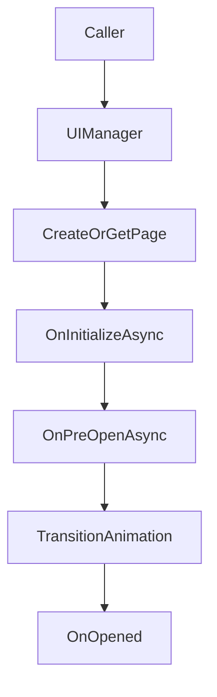

## UI

`TFramework.UI` は、Unityにおける画面遷移・ダイアログ表示・UIアニメーション・大量リスト表示（仮想スクロール）を、運用しやすい規約でまとめるためのモジュールです。画面数が増えたときに「表示状態」「遷移」「入力」「破棄」が破綻しやすい領域を、Page/Dialogの責務分割で抑えることを目的にしています。

---

## 概要

- **責務**: Page遷移、Dialog表示、UIアニメーション、UIコンポーネント（VirtualScroll等）
- **前提**: ライフサイクルは `IUIPageLifecycle` を中心に非同期で統一し、呼び出し側は「画面を開く/閉じる」だけに寄せる

---

## 設計目標

- **ライフサイクルの明確化**: 表示前後・初回初期化・破棄のタイミングを統一
- **非同期の標準化**: アニメーションやロードを `UniTask` で扱い、キャンセル可能にする
- **運用性**: 画面追加時にルールが崩れない（PageとDialogを分離、層を明確化）
- **性能**: 大量要素は仮想スクロールで支える

---

## 構成（抜粋）

- `Core/`
  - `UIManager`: UIの統合入口
  - `UIRoot`: ルート（Canvas等）
  - `UILayer`: 表示レイヤ定義
  - `UISettings`: UI設定
- `Page/`
  - `UIPageBase`: ページ基底
  - `IUIPageLifecycle`: ライフサイクル契約
- `Dialog/`
  - `UIDialogBase`: ダイアログ基底
  - `IUIDialog`: ダイアログ契約
  - `Common/*Dialog`: 共通ダイアログ（Message/Confirm/Loading）
- `Animation/`
  - `IUIAnimation`: アニメーション契約
  - `TransitionPresets`: プリセット
- `Components/`
  - `UIButton`, `TFTextUGUI`
  - `VirtualScroll/*`: 仮想スクロール（Fixed/Dynamic）

---

## データ/処理フロー（Pageを開く）

---

## APIの使い方（最小）

- **Page**: 画面は Page として開閉する（初期化は初回のみ、表示は毎回）
- **Dialog**: 画面と独立してスタック/キューとして扱う（確認・通知・ロード表示など）

---

## Settings

- `UISettings` を含む各Settingsは `Resources` 配下のアセット運用を前提にします。
- Settingsの作成/移動は `TFramework/Settings/Modules`（Settings Window）から行います。

---

## 未実装 / 今後

- `ROADMAP.md` の **フェーズ2**（UI/Localization/Time/Scene）を参照
- UI運用モデル（Pageスタック、Dialogキュー、戻る制御）のガイド整備

